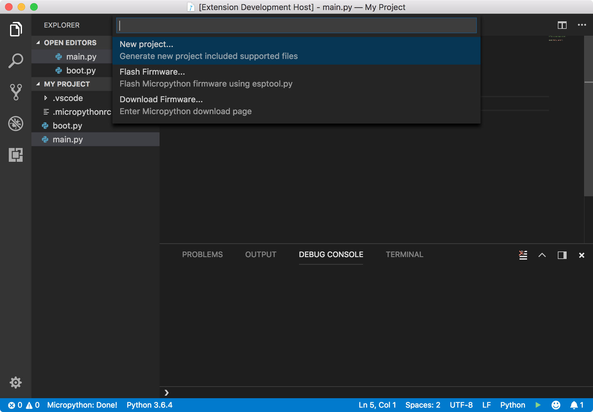

```
# Unfortunately, this project will be temporary stop developing from August 1st, 2018 to May 1st, 2019.
# Problems will be solved after that, included: issues, reports, new features (improve performance, UI,...).
# I'm sorry for that.
```

# Micropython IDE for VSCode README

Micropython integrated development for VSCode




## Features

- Flashing __Micropython__ firmwares into devices, current support flashing ESP8266, ESP32 boards using `esptool.py`.
- Generate new project with supported files.
- Support send project files into board.
- Support Serial Monitor for debugging your scripts.

## Requirements

**This extension required `python` with `pip` (_python package installer_) installed on your system operation.**

#### Python
If you do not have already installed Python, you can downloading from the [official site](https://www.python.org/downloads/). You can use python 2.x but I'm recommend using 3.x will better.


#### Pip
Pip is a installer for python modules that both downloads and installs the modules, if you are not already installed pip, please [click here](https://pip.pypa.io/en/stable/installing/#do-i-need-to-install-pip).

#### Ampy
Ampy allows you to interact with the file system created on the chip. This module is required for this extension. You can install ampy by pip:

```bash
pip install adafruit-ampy
```

#### rshell
Remote Shell for MicroPython. This module is required for this extension. You can install rshell by pip:

```bash
sudo pip3 install rshell
```
or:

```bash
sudo pip install rshell
```

## How to use


### Create new project:
First, you need to generate new project by open **Getting Started** menu.

To open **Getting Started...** menu, you can press shortcut **⌘ + ⇧ + P** keys, then find from commands list with keyword: `Micropython: Gettings Started`.

You can integrate with existing project by creating `.micropythonrc` file into your project root directory. This file stores build and debug settings for your project.

Example `.micropythonrc` file:

```json
{
  "upload": {
    "port": "/serial/port",
    "baud": 115200
  },
  "serial": {
    "port": "/serial/port",
    "baud": 115200
  },
  "paths": {
    "root": "./myproject",
    "ignore": {
      "extensions": [
        ".md"
      ],
      "directories": [
        ".git",
      ]
    }
  },
  "tools": {
    "ampy": "/path/to/ampy",
    "rshell": "/path/to/rshell"
  }
}
```

`paths.root` - path with a python files for upload.

### Run project:
You can run project by move to script file from prject directory. From VSCode status bar, press ▶ button in the bottom right. Or using `Run` command from commands list.

### Stop running script:
To stop running script, you can stop by press ◼ button in the bottom right. Or using `Stop` command from commands list.

### To Flash Micropython firmware
From **Getting Started** menu, select **Flash Firmware** then follow the step-by-step instructions.


## Extension Settings

**This extension has no settings for this release. You just press ⌘ + ⇧ + P then type prefix _Micropython_ to see tasks list:**

- **Micropython**: Getting started
- **Micropython**: Run...
- **Micropython**: Stop...
- ...


## Known Issues

This extension has been tested on MacOS. If you have any trouble with your OS. Please contact me soon by open issue or via email address: [dinophan94@gmail.com](mailto:dinophan94@gmail.com). All requests appropriate!


## Contact & Supports

- [Github](https://github.com/dphans/micropython-ide-vscode)
- [Support Email](mailto:dinophan94@gmail.com)


## Release Notes

Users appreciate release notes as you update your extension.

### 0.0.1

First release
